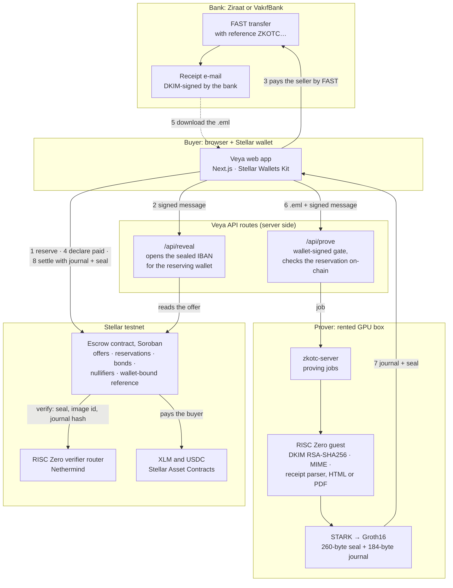

# Veya

**Buy XLM or USDC with a direct Turkish bank transfer. Settled on Stellar by a zero-knowledge proof of the bank's own receipt, without a third party.**

Live on Stellar testnet: **https://www.veya.lol** · Stellar Pro Hackathon, Istanbul, September 2026 (Genesis Track)


## The problem we solve

Türkiye has instant, free transfers between every bank (FAST) and heavy everyday demand for crypto. The rail exists; the
evidence does not.

- **Exchanges** solve lira-to-crypto with custody, KYC and a spread. Your coins sit with someone else.
- **P2P desks** run on screenshots. A receipt screenshot takes a minute to edit, so escrows freeze and a moderator decides who
  is telling the truth.
- **The gap:** no smart contract can check by itself that a lira payment really happened.

Veya closes that gap. Ziraat and VakıfBank, two of the largest banks in Türkiye, sign every receipt e-mail they send with DKIM.
That e-mail is a cryptographic proof of payment. Veya verifies it inside a zkVM and lets a Soroban contract release the crypto.

## How it works

1. **Reserve.** A seller's XLM or USDC is already locked in the escrow. The buyer reserves an amount; the seller's IBAN is
   sealed on-chain and revealed to that buyer only, after a wallet signature.
2. **Pay.** The buyer sends lira by FAST from their own bank, with a short reference (`ZKOTC<id><code>`) that names their wallet.
3. **Prove.** The buyer drops the bank's receipt e-mail (`.eml`). A RISC Zero proof is generated in 10 to 20 seconds.
4. **Receive.** The escrow verifies the proof on Stellar and releases the crypto to the buyer's wallet.

### Architecture

The numbers on the arrows follow one trade from reservation to settlement.



The e-mail never goes on-chain. The chain sees the seal and a 184-byte journal: bank key hash, bank domain hash, payee hash,
amount, date, nullifier, reservation id and reference hash. The escrow checks every one of them.

## Why it cannot be gamed

| Attempt | Result |
|---|---|
| Change one character inside the receipt | rejected: `Dkim(BodyHashMismatch)` |
| Move the bank's `Date` header by one second | rejected: `Dkim(SignatureInvalid)` |
| Reuse a receipt for another reservation or wallet | rejected: the payment reference does not match |
| Replay a receipt that already settled | refused by the escrow: nullifier already spent |
| Pay the wrong account or too little | rejected: payee hash or amount does not match the offer |

**What is still trusted (testnet):** the operator holds the key that reveals sellers' IBANs, sees uploaded e-mails in memory
while proving, and holds the contract's admin key (image id, bank keys, upgrades; every change is a public transaction).
Planned: timelock on admin actions, reproducible guest build, reveal key inside an attested enclave. Both banks' DKIM keys
are RSA-1024.

## Deployed on Stellar testnet

| | |
|---|---|
| Escrow (Soroban) | `CAFU5GMKM3UNZ3VLOZ7HX5HDFB7L7U2HM3UZLYLTFHIQLILIEYN5SDLG` |
| RISC Zero verifier router (Nethermind) | `CBHIBH3T5ZZL6ZZZJFKS5QQKSB2VQ4D7GMBKQLNOQ7P2XBMPGVPG3FCG` |
| Guest image id (`prover/IMAGE_ID`) | `0xaa06027db8c3d4877dd43d5117c7408f11765cff75db3f618059e0cc13916e4b` |
| XLM (SAC) | `CDLZFC3SYJYDZT7K67VZ75HPJVIEUVNIXF47ZG2FB2RMQQVU2HHGCYSC` |
| USDC (SAC) | `CBIELTK6YBZJU5UP2WWQEUCYKLPU6AUNZ2BQ4WWFEIE3USCIHMXQDAMA` |

Also published at [`veya.lol/.well-known/stellar.toml`](https://www.veya.lol/.well-known/stellar.toml). History and upgrade
notes: [`contracts/DEPLOYMENTS.md`](contracts/DEPLOYMENTS.md).

**Status:** 5 trades settled with real lira (₺308), 2 banks, 10 offers. Example settled trade:
[veya.lol/r/14](https://www.veya.lol/r/14).

## Try it

1. Open https://www.veya.lol and connect a testnet wallet (Freighter or any Stellar Wallets Kit wallet, funded by
   [Friendbot](https://lab.stellar.org/account/fund?$=network$id=testnet)).
2. **Buy:** pick an offer, reserve, reveal the seller's IBAN.
3. Pay by FAST from Ziraat or VakıfBank with the reference shown, then press **I have sent the transfer**.
4. In Gmail open the bank's receipt, choose *Show original* → *Download original*, and drop the `.eml`. Claim when the proof is ready.

No Turkish bank account? Open a settled trade, or post an offer from the **Sell** tab.

## Stellar integrations

- **Soroban escrow:** offers, reservations, seller bonds and proof-gated settlement in one contract.
- **RISC Zero verifier router** (Nethermind): verifies the Groth16 seal inside the settle transaction.
- **Stellar Wallets Kit:** every signature in the app.
- **XLM and USDC** as market assets, through their Stellar Asset Contracts.
- **SEP-1** `stellar.toml` with the contract ids; **SEP-53** signed messages gate the IBAN reveal and the prover.

## Repository

| Path | What |
|---|---|
| `contracts/escrow` | Soroban escrow: ads, reservations, bonds, wallet-bound reference, nullifiers (22 tests) |
| `zkotc-lib` | zkVM-agnostic core: DKIM verifier, MIME, Ziraat HTML and VakıfBank PDF receipt parsers (16 unit tests + 10 on real e-mails) |
| `prover` | RISC Zero guest, `zkotc` CLI and `zkotc-server` (proving jobs API, GPU Groth16) |
| `web` | Next.js app: market, offers, reservation flow, `/api/reveal`, `/api/prove` (26 tests) |
| `scripts/gpu` | One-command deploy of the prover to a rented GPU box |
| `docs` | [`TECHNICAL-DESIGN.md`](docs/TECHNICAL-DESIGN.md), [`GPU.md`](docs/GPU.md), [`ROADMAP.md`](docs/ROADMAP.md) |

## Run it

```sh
cargo test --manifest-path contracts/escrow/Cargo.toml    # escrow
cargo test --manifest-path zkotc-lib/Cargo.toml           # DKIM, MIME, receipt parsers

cd web && cp .env.example .env.local && npm ci && npm run dev    # http://localhost:3000
npm test                                                          # web tests
```

Proving needs a CUDA GPU: rent one and run `scripts/gpu/deploy.sh "<ssh line>"` ([`docs/GPU.md`](docs/GPU.md)). The web
app reaches the prover only through its own `/api/prove` routes, set by the server-side `PROVER_URL`.

## Design decisions and trade-offs

- **The bank's e-mail as evidence, not an oracle or an API.** Nothing to integrate with the bank and nobody to trust, at the
  cost of one manual step: the buyer exports the `.eml`.
- **RISC Zero zkVM instead of a hand-written circuit.** DKIM, MIME and a PDF parser are ordinary Rust, tested natively; the
  price is proving time, solved with a GPU (84 minutes on a CPU, about 11 seconds on an RTX 4090).
- **Reference in the transfer description.** Binds a receipt to one reservation and one wallet, so a stolen e-mail is useless.
- **Seller bond and a protection window.** A seller who releases after the buyer declared payment loses a bond slice to a
  later valid proof.
- **Sealed IBAN.** Only a hash is public; the reveal service is the one trusted component on the roadmap to remove.

## Challenges

- Ziraat prints what the payer typed *before* the bank's own block: the parser reads bank fields only after the bank's
  last own marker, so typed text cannot inject fields.
- VakıfBank sends a PDF: a small `no_std` PDF text extractor (inflate, CID fonts, ToUnicode maps) runs inside the zkVM.
- Gmail rewrites VakıfBank's malformed `Message-ID`; the verifier restores the signed value from `X-Google-Original-Message-ID`.
- RISC Zero's CUDA Groth16 wrap crashes in 3.0.x, so the wrap runs on an ICICLE GPU worker; on many-core hosts the prover is
  pinned to 16 threads on the GPU's NUMA node.

