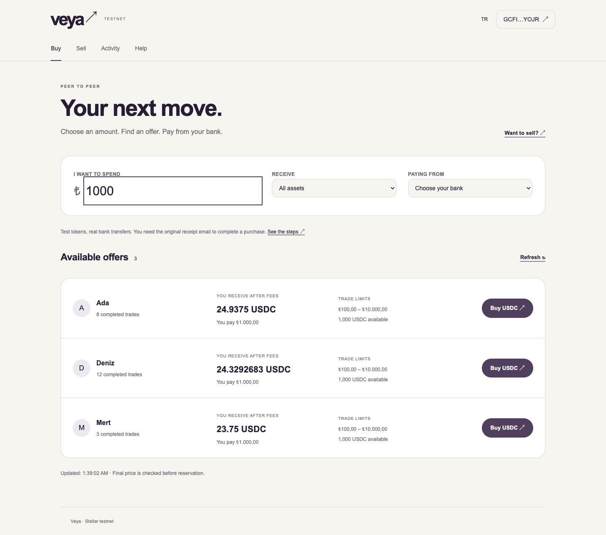

# Veya internal UX review — 15 September 2026

**Verdict: approve for PR review; insufficient evidence for a production-money release.**

This is the requested `roast-me` self-review of the internal UX changes against
`VEYA-UX-PLAN.md`. It is not an independent audit. The review covered the current
source, contract state rules, installed wallet SDK signatures, executable component
tests, a production build, and Chrome layouts. No bank transfer or live settlement
was performed.

## Confirmed defects corrected

| Finding and concrete consequence | Correction | Evidence |
|---|---|---|
| A failed contract `release` result could still produce a success toast. | Unwrap the contract result before announcing success. | Regression test rejects `LockActive` and finds no success state. |
| Receipt processing consent started checked; invalid files reached wallet/prover work. | Fresh unchecked consent, reset on file change, original `.eml` and 2 MiB admission checks, single upload at a time. | File/consent tests; limit matches the server's advertised 2 MiB boundary. |
| Seller bond estimates used floating-point/ceiling arithmetic; formatting hid token precision; a token input of `1,25` became `125`. | Integer bond/fee math, exact decimal display, comma rejection for token amounts with explicit dot guidance. TRY retains its Turkish punctuation rules. | Integer boundary tests and seller review of 500 + 25 = 525 tokens. |
| Funding sessions survived wallet changes and old quotes could overwrite new amounts. | Key funding sessions by wallet, bind quotes to side/amount, ignore stale responses, validate limits before requesting instructions. | Delayed quote, wallet change, stale-load and provider-limit tests. |
| My first implementation reset an unconnected buyer's draft when they connected. That contradicted the readiness requirement. | Preserve first-connection drafts; reset on subsequent disconnect/account changes. | A test connects without reserving and verifies amount/readiness survive. |
| A buyer who had already paid could be stranded by the expired declaration deadline. | Explicit already-paid receipt recovery; no new payment instruction. No claim that the declaration window remains open. | Expired undeclared trade test; contract `settle` allows an active reservation while `declare_paid` rejects an expired lock. |
| Retry errors disappeared on refresh, and my first offer implementation hid the quote after a wallet rejection. | Separate read failures from mutation failures and keep the quote available for retry. | Rejected transaction test, source review of `loadErr` separation. |
| Mobile addresses caused horizontal overflow, and Turkish disclosure controls wrapped letter by letter. | Constrain transactional content, allow long identifiers to wrap, keep small control labels intact; use a keyboard-operable native bank selector. | 320/390px assertions and visual inspection of screenshots. |
| A KYC request failure was silently swallowed by the existing funding client. | Propagate the provider error instead of continuing authentication as if it succeeded. | Source review; live KYC acceptance remains unverified. |
| A settled trade's receipt was recomputed using today's configurable fee. | Show the immutable pre-fee amount and link to wallet history for confirmed payout; do not invent a historical receipt. | Source review. |

Other changes include amount-first discovery, fresh offer revalidation, shared
navigation, first-step bank/receipt guidance, focused activity actions, three-step
seller setup, help/funding pages, EN/TR interface copy, and guarded proof restoration.
Raw receipt content is not added to persistent storage. Market filters are stored
per tab; only proof job identifiers are stored for resumption.

## Verification

- `npm test`: 26 tests covering money rounding, unavailable offers, unsupported bank,
  connection without reservation, changed price, rejected/duplicate actions, payee
  mismatch, expired payment recovery, invalid receipt/consent, lost job, unavailable
  prover, failed release, wallet isolation, seller review, focus refresh, stale funding
  quotes, provider limits, wrong network, account changes during signing and late reads.
- `npm run lint`: clean.
- `npm run build`: successful production compilation, TypeScript and prerendering.
- Chrome fixture checks: 36 page/state/viewport combinations plus four seller
  walkthroughs using keyboard bank selection; EN/TR, light/dark, 320/390/1440px and
  reduced motion. Asserted no horizontal overflow, one heading and no page exceptions.
- Production-server smoke: home, market, sell, activity, help, funding and malformed
  offer/trade links returned HTTP 200, no page exceptions and no 390px overflow.
  This checkout has no live escrow/token/anchor environment configuration, so those
  smoke checks establish unavailable/empty UI behavior, not working transactions.

## Remaining evidence gaps and existing limits

- Real extension prompts, signatures, bank/mail export, proof generation and chain
  settlement need a configured testnet integration run. No successful payment or
  throughput claim follows from the mocks.
- No moderated usability session with an independent user was possible here.
- Activity retains the existing latest-200 market-reservation read bound. The UI
  discloses this and provides a direct older-trade lookup; it is not an indexed full
  account history. Funding history can reopen status, but does not reconstruct an
  unknown withdrawal memo for a new payment.
- Provider/contract error payloads and bank menu names may remain in their original
  language. Interface labels and the main recovery guidance have EN/TR copy.
- `npm audit` reports an existing transitive high-severity Axios advisory set. Axios
  is 1.16.0 in both the base and this lockfile; it was not introduced by the test
  tooling. This review does not claim a dependency-security clearance.
- Next reports an unrelated ancestor `pnpm-lock.yaml` outside this Git repository;
  the build succeeds. No deployment, merge or automatic follow-up was performed.

## Reproduce

From `web`:

```sh
npm ci
npm test
npm run lint
npm run build
npm run test:browser-fixture
# In another terminal (requires installed Chrome):
node tests/browser/check.mjs
```

The Vite fixture imports actual page components with simulated services. It lives
under `web/tests/browser`, outside Next's routes, and sends no money or receipt.
Screenshot output defaults to `/tmp/veya-ux-screenshots`.

## Selected fixture screenshots

These images contain synthetic trade/bank information, not live financial activity.



[Turkish mobile receipt flow](veya-ux/receipt-mobile-tr.png) ·
[Mobile seller review](veya-ux/seller-review.png)
